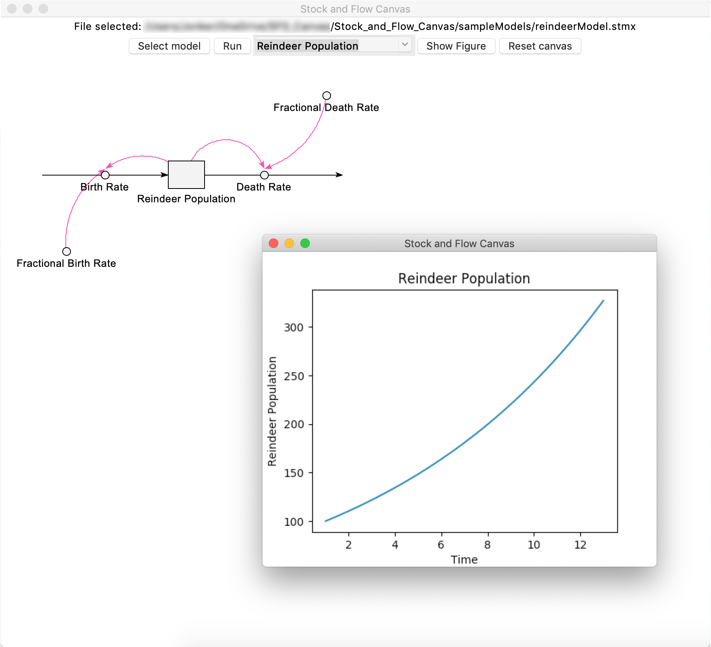

# Stock and Flow Canvas

## Acknowledgement

Simulation of system dynamics models is made possible using the **PySD** project.
https://github.com/JamesPHoughton/pysd

## Introduction

This module of project is a python realization of Stock and Flow Diagram display, based on **Tkinter**.
The intention is to allow users to visually view the model.

Here you can have a quick glance of it:

**Model display:**


**Simulation result display:**



## How to use

**Local-based Display**

Stock and flow diagrams created by Stella can be displayed using this software.

To display the diagram itself, no additional package other than **Python3** is needed.

To simulate the the model and display the result, **PySD** and **matplotlib** are also needed.

The program could be run from terminal, PowerShell, or CMD by executing:

```
python3 localMain.py
```

Then you can load the model, simulate and view the outcome in the graphic interface.
