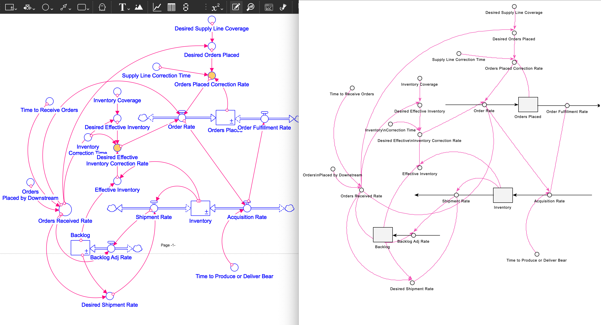
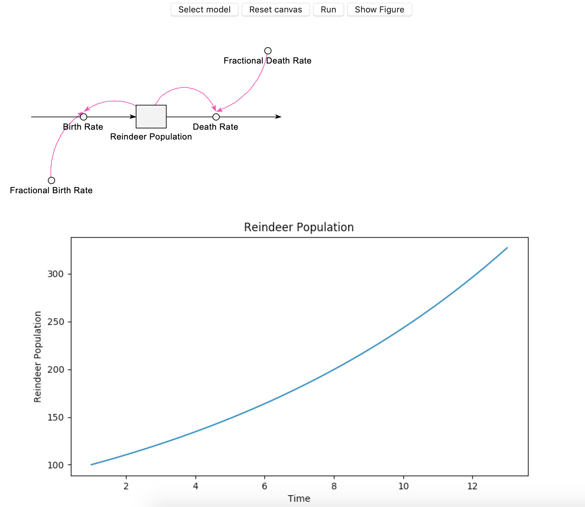

# Stock and Flow Canvas

## Introduction

This is a python realization of Stock and Flow Diagram display, based on ***Tkinter***.
The intention is to allow users to visually view the model.
Here you can have a quick glance of it:

Model display:


Simulation outcome display:


## How to use

Stock and flow diagrams created by Stella can be displayed using this software.

To display the diagram itself, no additional package other than ***Python3*** is needed.

To simulate the the model and display the outmoce, ***PySD*** and ***matplotlib*** are also needed.

The program could be run from terminal, powershell, or CMD by executing:


```
python3 main.py
```

Then you can load the model, simulate and view the outcome in the graphic interface.

Many thanks given to the ***PySD*** project.

## Change Log

**17 Nov 2018: v0.2**

1.  Initial interface to PySD. Now able to run the model.
2.  Incorporated graph display using matplotlib to display simulation result of one variable. (Still testing, now only work with reindeerModel.stmx)

**15 Nov 2018: v0.1.1**

1.  Connector display function rewritten. Now connectors could be displayed in almost the identical way Stella is using.
2.  GUI-based model loading function added.

**10 Nov 2018: v0.1**
1.  First Commit.
